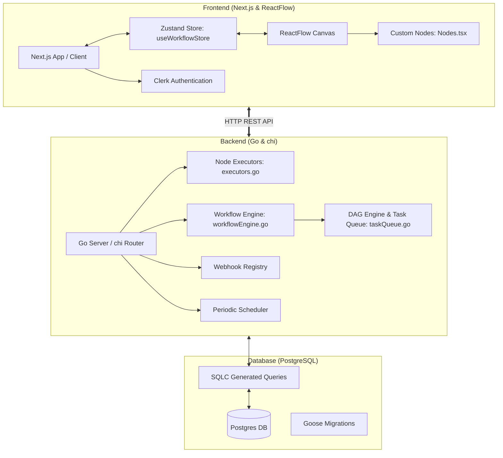
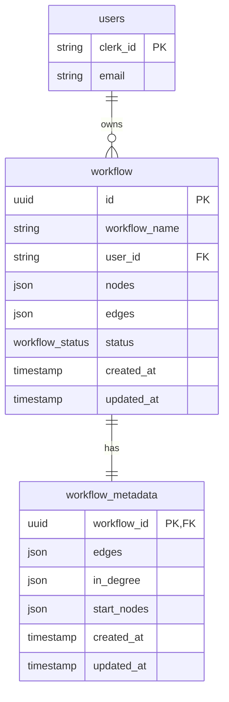
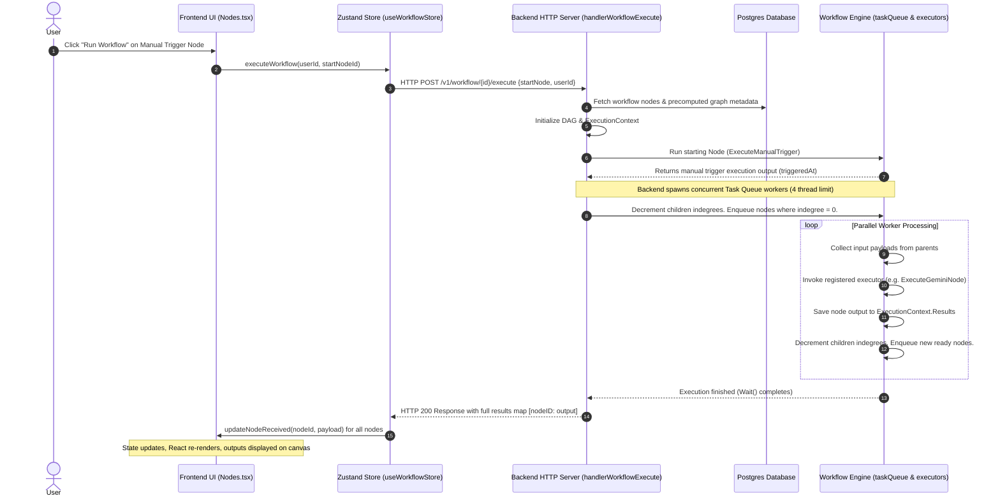

# Project Architecture & Workflow Execution Guide

This document provides a comprehensive analysis of the **n8n-clone** project architecture, detailing how the frontend and backend interact, how the database stores workflow schemas, and the precise step-by-step execution flow of workflows when triggered.

---

## 🗺️ High-Level System Architecture

The project is structured as a monorepo consisting of a **Next.js Frontend** (`apps/web`) and a **Go Backend** (`apps/backend`).



---

## 💻 1. Frontend Architecture (`apps/web`)

The frontend is a modern React application built on Next.js, using standard web components, TailwindCSS styling, and ReactFlow to deliver a visual node-based editor.

### Key Components

- **[`Flow.tsx`](apps/web/components/Flow.tsx)**: The wrapper component that initializes the ReactFlow editor, handles auto-saving (via custom debouncing), enables canvas-level actions (saving, renaming, activating/deactivating), and binds standard canvas operations (`onNodesChange`, `onConnect`, `onEdgesChange`).
- **[`useWorkflowStore.ts`](apps/web/hooks/useWorkflowStore.ts)**: A state manager powered by **Zustand**. It centralizes UI state (active nodes, connection lines, dirtiness markers) and interacts directly with backend endpoints (`/workflow`, `/workflow/status`, and `/workflow/{id}/execute`).
- **[`Nodes.tsx`](apps/web/components/nodes/Nodes.tsx)**: Houses customized ReactFlow node types. Every custom node displays its specific parameters inside a Shadcn dialog and renders its execution payload output in a dedicated UI container:
  - `triggerManually`: Initiates execution from the frontend.
  - `geminiNode`: Sends prompts to Google Gemini AI.
  - `showOutput`: Renders string/JSON payload results.
  - `webhookNode`: Displays dynamic HTTP Webhook endpoints.
  - `mergeNode`: Consolidates multi-path branches.
  - `schedulerNode`: Configures time-interval setups.
  - `resendNode`: Dispatches emails via Resend.

---

## ⚙️ 2. Backend Architecture (`apps/backend`)

The backend is built in **Go** for high efficiency, using concurrent workers to process topological graphs in parallel.

### Key Modules

- **DAG Parser (`apps/backend/utils/dag.go`)**: Converts client nodes and connections into a Directed Acyclic Graph. Performs topological validation checks (`HasCycle`, `TopologicalSort`) to prevent infinite loops.
- **Workflow Engine (`apps/backend/utils/workflowEngine.go`)**: Gathers outputs of previous parent nodes using `CollectInputs` and triggers executors.
- **Task Queue (`apps/backend/utils/taskQueue.go`)**: Manages concurrency. Nodes are run in parallel using a thread-safe task worker pool (defaulting to 4 Go goroutine workers).
- **Node Registry & Executors (`apps/backend/utils/executors.go` & `apps/backend/utils/nodeRegistry.go`)**: Map string nodes (`geminiNode`, `resendNode`, etc.) to specific Go functions executing third-party API queries or payload logic.
- **Triggers & Registries (`apps/backend/utils/webhookRegistry.go` & `apps/backend/utils/schedulerRegistry.go`)**: Dynamically open public URL HTTP endpoints and fire tick-interval scheduler routines in background goroutines for active workflows.

---

## 🗄️ 3. Database Schema

The relational database is **PostgreSQL**, with schemas migrated using **Goose** and query structures generated using **SQLC**.



### Table Definitions

1. **`users`**: Manages basic user mapping aligned with Clerk accounts.
2. **`workflow`**: Stores ReactFlow state configuration (`nodes` JSON, `edges` JSON, `status` toggle enum: `active` or `not-active`).
3. **`workflow_metadata`**: Created during workflow saves/updates. Stores optimized graph-theory values (`in_degree` map, `edges` adjacency list, and `start_nodes` array) to bypass runtime compilation overhead.

---

## 🔄 4. Complete Workflow Execution Flow (Step-by-Step)

Here is exactly what happens when a workflow is triggered.

### Option A: Manual Trigger Flow (Frontend Click)



#### Detailed Code Mechanics

1. **Frontend Action**: Clicking on `triggerManually` calls `executeWorkflow` in [useWorkflowStore.ts](apps/web/hooks/useWorkflowStore.ts):

   ```typescript
   const response = await fetch(
     `${BACKEND_URL}/workflow/${workflowId}/execute`,
     {
       method: "POST",
       headers: { "Content-Type": "application/json" },
       body: JSON.stringify({ startNode: startNodeId, userId }),
     },
   );
   ```

2. **Backend Handler**: Received in Go at `HandlerWorkflowExecute` ([handlerWorkflowExecute.go](apps/backend/routes/handlerWorkflowExecute.go)).
3. **Metadata Parsing**: DB returns precompiled metadata via SQLC queries. The JSON columns `edges` and `inDegree` are converted into the in-memory struct:

   ```go
   dag := &utils.DAG{
       Nodes:    make(map[string]utils.Node),
       Edges:    edges, // e.g. {"1": ["2", "3"]}
       InDegree: make(map[string]int),
   }
   ```

   > [!NOTE]
   > **Reachable Subgraph Execution**: During execution context initialization, the engine traverses the DAG using Depth-First Search (DFS) starting from the `startNode` to identify all reachable nodes. The context-level in-degree map (`execCtx.InDegree`) is built only for these reachable nodes, ignoring incoming edges from unreachable nodes. This prevents execution from getting stuck on downstream nodes that have dependencies on parts of the workflow that are not being run.

4. **Running Node Queue**: The start node runs first. Then, children are processed using the thread pool worker queue:

   ```go
   queue := utils.NewTaskQueue(100)
   queue.StartWorkers(ctx, 4, func(ctx context.Context, nodeID string) error {
       // Execute the individual node
       if err := utils.ExecuteNode(ctx, nodeID, dag, execCtx); err != nil { ... }
       // Decrement child indegrees and enqueue children if they hit 0
       for _, child := range dag.Edges[nodeID] {
           execCtx.InDegree[child]--
           if execCtx.InDegree[child] == 0 {
               queue.Enqueue(child)
           }
       }
       return nil
   })
   ```

5. **Output Aggregation**: When `queue.Wait()` releases, the server replies with JSON containing the aggregated data map `Results` of all executing blocks.
6. **Store Refresh**: Frontend store applies output data back into node attributes (`node.data.received`), triggering reactive visual renders of output text fields.

---

### Option B: External Webhook Trigger Flow

For workflows containing a `webhookNode` and marked `active`:

1. **Activation**: Saving/activating registers the webhook URL dynamically inside the Go global `WebhookRegistry` map: `/webhook/{workflowID}/{nodeID}`.
2. **Request Handling**: An external client makes a POST request to `/webhook/{workflowID}/{nodeID}` with a custom JSON body.
3. **Mapping**: The routing engine intercepts the request inside `HandlerWorkflowWebhook` ([handlerWorkflowWebhook.go](apps/backend/routes/handlerWorkflowWebhook.go)), verifying the route exists.
4. **Execution**:
   - It extracts the request JSON payload.
   - It pre-populates the webhook start node results: `execCtx.Results[nodeID] = map[string]any{"payload": payload}`.
   - It triggers downstream tasks in parallel, identical to manual execution.
5. **Termination**: Returns HTTP 200 once execution completes.

---

### Option C: Time-Interval Scheduler Flow

For workflows containing an active `schedulerNode`:

1. **Goroutine Timer Initialization**: During server startup or workflow status toggles to `active`, the engine parses Go duration settings (e.g. `5m`, `30s`) and invokes `GlobalScheduler.StartSchedule(...)` ([periodicScheduler.go](apps/backend/utils/periodicScheduler.go)).
2. **Cron Thread Ticker**: Spawns a background goroutine loop running a `time.Ticker`:

   ```go
   go func() {
       for {
           select {
           case <-stop: return
           case t := <-ticker.C:
               trigger(ctx, event) // Run buildTriggerFn
           }
       }
   }()
   ```

3. **Database Execution**: When triggered, it queries DB nodes, builds the execution context, executes the scheduler node, and maps downstream children to parallel task workers in the background.
